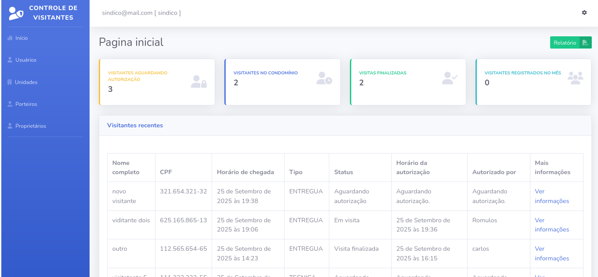
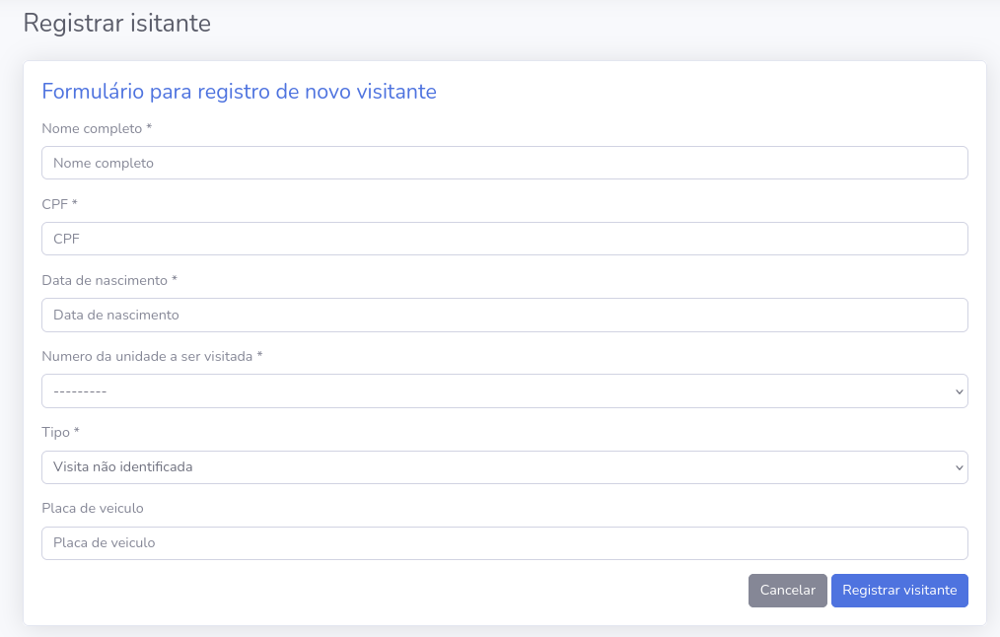
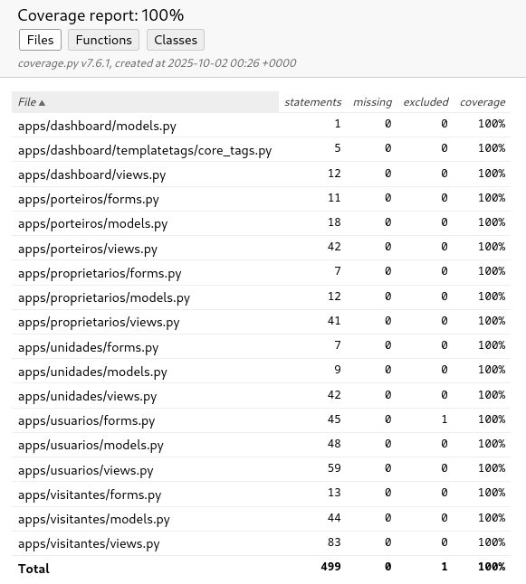

[JAVASCRIPT__BADGE]: https://img.shields.io/badge/Javascript-000?style=for-the-badge&logo=javascript
[PYTHON_BADGE]: https://img.shields.io/badge/python-3670A0?style=for-the-badge&logo=python&logoColor=ffdd54
[HTML__BADGE]: https://img.shields.io/badge/html5-%23E34F26.svg?style=for-the-badge&logo=html5&logoColor=white
[CSS__BADGE]: https://img.shields.io/badge/css3-%231572B6.svg?style=for-the-badge&logo=css3&logoColor=white
[DJANGO_BADGE]: https://img.shields.io/badge/django-%23092E20.svg?style=for-the-badge&logo=django&logoColor=white
[SQLITE_BADGE]: https://img.shields.io/badge/sqlite-%2307405e.svg?style=for-the-badge&logo=sqlite&logoColor=white
[DjangoREST]: https://img.shields.io/badge/DJANGO-REST-ff1709?style=for-the-badge&logo=django&logoColor=white&color=ff1709&labelColor=gray
[COVERAGE]: https://img.shields.io/badge/coverage-100%25-brightgreen?style=for-the-badge&&logoColor=white&color=ff1709&labelColor=gray
[MIT_BADGE]: https://img.shields.io/badge/License-MIT-yellow.svg?style=for-the-badge&logoColor=white&color=ff1709&labelColor=gray

<h1 align="left" style="font-weight: bold;">Controle de visitas 💻</h1>

<br>

![django][DJANGO_BADGE]
![python][PYTHON_BADGE]
![javascript][JAVASCRIPT__BADGE]
![html][HTML__BADGE]
![css][CSS__BADGE]
![sqlite][SQLITE_BADGE]
![coverage][COVERAGE]
![license][MIT_BADGE]

<br>
<p align="center">
  <a href="#add">✨ Melhorias</a> • 
  <a href="#started">🚀 Iniciando</a> • 
  <a href="#routes">📍 Rotas</a> •
  <a href="#screenshots">📸 Screenshots</a> •
  <a href="#tests">🧪 Testes</a>
  <a href="#license">📜 Licença</a>
</p>

<br>
<p align="justify"> Este projeto tem como objetivo demonstrar uma aplicação simples para o controle de acesso de visitantes em um condomínio utilizando <b>Django</b>. A proposta é fornecer um <i>dashboard</i> para que o porteiro registre e acompanhe as visitas, permitindo monitorar os status de entrada e saída. Além disso, o síndico e administradores têm acesso a funcionalidades de gestão, como cadastros, alterações e exportação de relatórios em CSV.

A aplicação foi desenvolvida com base no curso <a href="https://www.udemy.com/course/djangoframeworknapratica/">Django Framework na Prática</a>, com diversas melhorias e adaptações.
</p>

<br>
<h2 id="add">✨ Melhorias implementadas</h2>
 
  - Inclusão e mapeamento de testes automatizados com **coverage**
  - Novos **models, views, forms e templates**
  - Implementação de **logs de auditoria**
  - Relatório em **CSV**

<br>
<h2 id="started">🚀 Iniciando</h2>

Abaixo estão os passos para executar o projeto localmente.
Se preferir apenas visualizar a aplicação em funcionamento, acesse a versão em produção (adicione o link aqui, se houver).

<h3>Pré-requisitos</h3>

Antes de começar, verifique se possui instalado:

  - Python **3.8+**
  - Pip **23.0.1+**
  - Git **2.0+**

<h3>📥 Clonando o repositório</h3>

```bash
git clone your-project-url-in-github
```

<h3>🛠 Criando ambiente virtual</h3>

```bash
cd your-project-url-in-github
python -m venv venv
```
Ative o ambiente virtual:

  - **Linux/MacOS:** source venv/bin/activate
  - **Windows:** venv\Scripts\activate

<h3>📦 Instalando dependências</h3>

```bash
pip install -r requirements.txt
``````

<h3>🗂 Preparando o banco de dados</h3>

```bash
python manage.py makemigrations
python manage.py migrate
python manage.py createsuperuser
```

<h3>🚀 Iniciando o servidor</h3>

```bash
python manage.py runserver
```

<h3>👤 Criando o primeiro síndico</h3>

  1. Acesse http://localhost:8000/admin com o superusuário criado
  2. Crie um novo usuário com perfil **Síndico**
  3. Deslogue do admin e faça login na aplicação como Síndico

<br>
<h2 id="routes">📍 Rotas da aplicação</h2>

| Rota               | Descrição                                          
|----------------------|-----------------------------------------------------
<kbd>/ |Página inicial com o dashboard</kbd>
<kbd>/logout/ | Logout do usuário</kbd>
<kbd>/login/ | Página de login</kbd>
<kbd>/porteiros/ | Lista de porteiros</kbd>
<kbd>/porteiros/cadastrar/  | Cadastro de porteiros</kbd>
<kbd>/porteiros/editar/<int:porteiro_id>/ | Edição de porteiro</kbd>
<kbd>/proprietarios/ | Lista de proprietários</kbd>
<kbd>/proprietarios/cadastrar/ | Cadastro de proprietário</kbd>
<kbd>/proprietarios/editar/<int:proprietario_id>/ | Edição de proprietário</kbd>
<kbd>/unidades/ | Lista de unidades</kbd>
<kbd>/unidades/cadastrar/ |  Cadastro de unidade</kbd>
<kbd>/unidades/editar/<int:unidade_id>/ | Edição de unidade</kbd>
<kbd>/usuarios/  |  Lista de usuários</kbd>
<kbd>/usuarios/cadastrar/    |  Cadastro de usuário</kbd>
<kbd>/usuarios/editar/<int:usuario_id>/ |  Edição de usuário</kbd>
<kbd>/usuarios/perfil/  |  Atualização de senha do usuário</kbd>
<kbd>/visitantes/<int:id>/  | Detalhes do visitante e autorização de entrada</kbd>
<kbd>/visitantes/<int:id>/finalizar-visita/ |  Finalização da visita</kbd>
<kbd>/visitantes/exportar/  | Exportação em CSV</kbd>
<kbd>/visitantes/cadastrar/  | Cadastro de visitante</kbd>

<br>
<h2 id="screenshots">📸 Screenshots</h2>

<h3>🔑 Login</h3>

<h3>📊 Dashboard</h3>

<h3>📝 Cadastro de Visitante</h3>


<br>
<h2 id="tests">Testes com Coverage</h2>

```bash
coverage run manage.py test apps/
coverage report
coverage html
python -m http.server --directory htmlcov/ 8000
```
Abra http://localhost:8000 para visualizar o relatório:



<h2 id="license">📜 Licença</h2>

Este projeto está licenciado sob os termos da [MIT License](https://opensource.org/licenses/MIT).